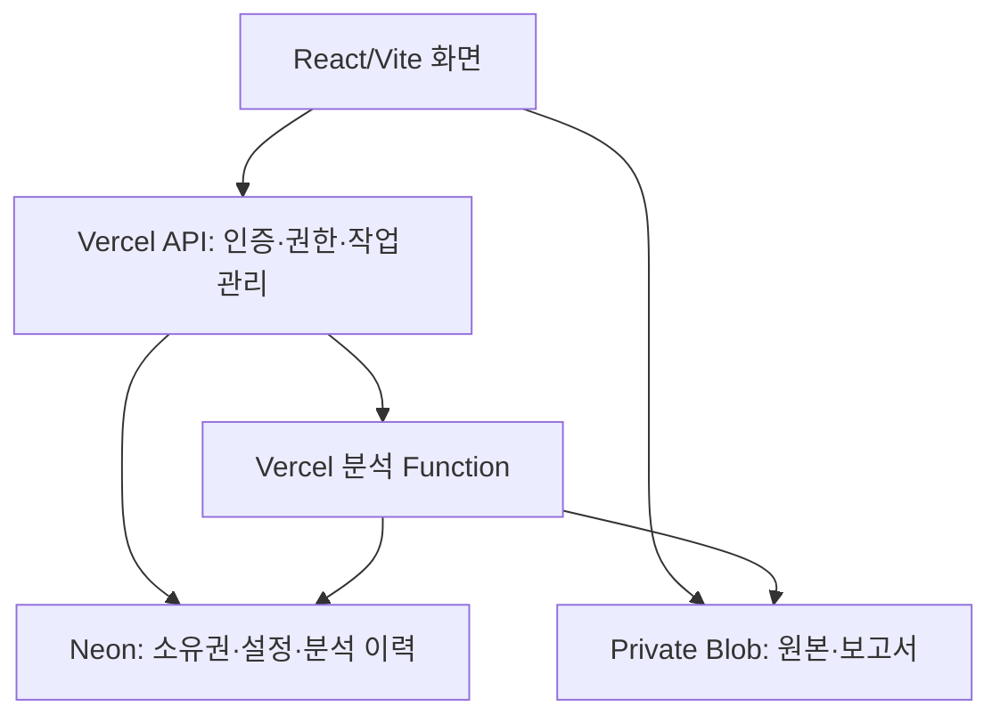

# Auto EDA Studio 웹앱 빌드 기술명세서

작성일: 2026-10-06 | 버전: 1.0 | 대상: React/Vite 기반 MVP 개발

## 1. 서비스 목표와 범위

사용자가 표 형식 데이터 파일을 업로드하면 데이터 구조와 품질을 점검하고, 적합한 그래프와 탐색적 데이터 분석(EDA) 보고서를 자동 생성한다. 사용자는 변수의 의미와 분석 대상을 수정하고 결과를 다시 생성할 수 있다. 교육자는 세 가지 내장 샘플로 서로 다른 데이터 특성을 설명할 수 있다.

핵심 사용자: 데이터 분석 입문자, 교육자, 실무 기획자. 기본 언어는 한국어이며 원본 변수명과 한국어 설명을 함께 제공한다.

MVP에 포함: CSV/TSV/TXT/XLSX 업로드, 파일 미리보기와 파싱 설정, 자동 자료형 추론, 기술통계, 결측·중복·상수열 점검, 단변량·이변량 그래프, 선택한 목표변수별 탐색, 규칙 기반 해석, 분석 이력 저장, 보고서와 그래프 다운로드, 세 가지 샘플 선택.

MVP에서 제외: 예측 모델 학습, 자동 인과 추론, 자동 결측치 보정·이상치 삭제, PDF/이미지 표 인식, 사용자 코드 실행, 무제한 대용량 파일, 외부 URL 임의 수집. LLM 설명은 2차 선택 기능이며 기본 분석에는 유료 AI API가 필요하지 않다.

## 2. 기술 스택

| 영역 | 선택 | 선택 이유 |
|---|---|---|
| 프런트엔드 | React + Vite + TypeScript | 빠른 개발 환경, 명확한 데이터 계약, SPA 구성 |
| UI | Tailwind CSS, 접근성 있는 UI 컴포넌트 | 일관된 화면과 키보드 조작 |
| 라우팅 | React Router | 업로드·결과·이력 화면 이동 |
| 서버 상태 | TanStack Query | 요청 상태, 재시도, 결과 캐시 |
| 그래프 | Apache ECharts | 히스토그램·박스플롯·산점도·히트맵, PNG/SVG 저장 |
| 테이블 | TanStack Table + 가상 스크롤 | 넓은 데이터와 페이지 단위 탐색 |
| 백엔드 | Vercel Node.js Functions + TypeScript | API와 분석 엔진을 서버에서 실행 |
| 파싱 | Papa Parse, ExcelJS, iconv-lite | 구분자 텍스트·XLSX·문자 인코딩 처리 |
| 통계 | simple-statistics + 자체 검증된 유틸리티 | 기술통계와 순위·상관 계산 |
| 입력 검증 | Zod | 설정·API·분석 결과 스키마 검증 |
| DB | Neon PostgreSQL | 분석 메타데이터·이력·구조화된 결과 저장 |
| DB 접근 | Drizzle ORM + @neondatabase/serverless | 타입 안전한 쿼리·마이그레이션, 서버리스 연결 |
| 파일 저장 | Vercel Blob의 private 저장소 | 원본·큰 결과 파일의 비공개 저장 |
| 인증 | Clerk React SDK + 서버 JWT 검증 | 사용자별 데이터 소유권 확인 |
| 배포 | GitHub → Vercel | PR Preview 및 운영 배포 |
| 검증 | Vitest + Playwright | 통계 정확성·업로드부터 보고서까지 검증 |

React/Vite를 유지한다. Next.js로 전환하지 않는다. 클라이언트가 Neon에 직접 접속하지 않는다. 원본 데이터 전체를 DB의 행별 테이블이나 거대한 JSONB 하나로 저장하지 않는다.

Vercel Functions에는 실행시간·메모리·요청 크기 제한이 있다. 업로드는 Blob 직접 업로드로 처리하고 분석은 제한된 용량에서 실행한다. Neon 드라이버는 HTTP/WebSocket 연결을 지원한다. [S1][S2][S3]

## 3. 시스템 구조



브라우저는 업로드 허가를 받은 뒤 파일을 private Blob에 직접 전송한다. API는 업로드 완료 후 저장소에서 실제 크기와 파일 정보를 확인한다. 분석 Function은 서버가 보유한 객체 경로를 이용해 읽으며 사용자가 보낸 임의 URL을 열지 않는다.

MVP는 제한된 단일 요청 분석 구조다. 분석 실행 요청은 완료까지 연결을 유지하고 UI는 별도 상태 API를 조회할 수 있다. 단순히 작업 ID를 반환한 뒤 메모리 내부 작업을 시작하는 방식은 금지한다. 2차의 장기 작업은 영속 큐·워크플로와 독립 실행 워커로 전환한다.

## 4. 사용자 흐름과 화면

1. 홈에서 파일 업로드 또는 벤츠·해군함정·와인 샘플을 선택한다.
2. 파일 검증 후 첫 100행을 미리 보여준다. 구분자·인코딩·헤더·XLSX 시트를 자동 선택하고 사용자가 수정할 수 있다.
3. 파일이 명확하면 기본 EDA를 자동 시작한다. 헤더가 없거나 파싱이 모호하면 설정 확인 후 시작한다.
4. 결과 화면에서 개요·품질 점검·분포·관계·목표변수·보고서 탭을 보여준다.
5. 목표변수·그룹변수·변수 유형을 수정하면 새 설정 버전의 분석을 생성한다.
6. 보고서를 내려받거나 분석 이력에서 다시 열고 삭제한다.

| 화면 | 필수 요소 |
|---|---|
| 홈 | 업로드 드롭존, 지원 형식·제한, 샘플 카드 3개 |
| 미리보기 | 첫 100행, 파싱 오류 행, 구분자·헤더·시트·인코딩 설정 |
| 분석 설정 | 목표변수 복수 선택, ID 제외, 유형 수정, 그룹 선택 |
| 결과 | 사용 행 수, 전체/표본 배지, 데이터 경고, 그래프와 설명 |
| 이력 | 파일명·상태·생성일·설정 버전·다시 실행·삭제 |
| 보고서 | 분석 질문, 계산된 사실, 해석, 한계, 다음 탐색 질문 |

차트의 원본 집계표와 대체 텍스트를 제공한다. 색상만으로 유형을 구분하지 않는다. 오류 메시지는 파일 문제와 서버 문제를 구분한다. 빈 그래프 대신 계산 불가 사유를 표시한다.

## 5. 파일 입력 계약과 제한

아래 제한은 제품의 초기 설계값이며 Vercel 제공 한도 자체가 아니다. 벤츠처럼 넓은 데이터를 지원하도록 셀 수를 함께 제한한다.

| 항목 | MVP 설계값 |
|---|---|
| 파일 수 | 일반 업로드 1개, 와인 비교 프리셋만 2개 |
| 파일 크기 | 파일당 최대 10 MiB, 비교 합계 최대 20 MiB |
| 데이터 크기 | 최대 50,000행, 500열, 2,000,000셀을 모두 충족 |
| XLSX | .xlsx만 지원, 시트 1개 선택, 압축 해제 후 50 MiB 제한 |
| 문자열 | 셀당 10,000자, 열 이름당 200자 |
| 파싱 | UTF-8/BOM 우선, CP949/EUC-KR 수동 설정 지원 |
| 구분자 | 쉼표·세미콜론·탭·연속 공백 후보 |
| 숫자 | 소수점·천 단위 구분자는 확인 가능한 설정으로 처리 |
| 기본 시간 예산 | 실행 제한 180초, 엔진 내부 150초에서 중단·정리 |

파일 확장자·MIME·실제 내용 형식을 함께 검증한다. XLSX 수식은 실행하지 않고 캐시된 값만 사용하며 캐시가 없으면 경고한다. TXT 공백 파서는 일반 CSV 파서와 분리한다. 잘못된 행은 조용히 버리지 않고 행 번호와 이유를 보여준다. 헤더 중복은 내부 고유 ID를 부여하고 원본명은 보존한다. 빈 문자열과 설정된 결측 토큰을 처리하되 숫자 0은 결측으로 바꾸지 않는다. 날짜 추론은 엄격한 형식만 적용한다.

## 6. EDA 엔진 규칙

### 6.1 변수 역할

지원 유형: numeric, categorical, boolean, ordinal, datetime, text. 별도 역할: identifier, target, group, ignored. 열의 저장 타입과 분석 역할을 분리한다. 숫자로 저장된 ID는 숫자 변수 상관계수에서 기본 제외한다. 이진 숫자열은 이진 변수로 인식하고 사용자가 변경할 수 있다. 범용 업로드에서는 목표변수를 강제로 추측하지 않는다.

### 6.2 계산 항목

| 대상 | 계산 | 그래프 |
|---|---|---|
| 전체 | 행·열·유효 셀·결측·정확히 중복된 행·상수열 | 개요 카드, 결측 막대 |
| 수치형 | count, mean, median, sample SD, min, Q1, Q3, max, IQR | 히스토그램, 박스플롯 |
| 범주형·이진 | 빈도·비율·고유값 수 | 상위 20개 빈도 막대, 나머지 합계 |
| 순서형 | 점수별 빈도·비율, 중앙값, 사분위수 | 순서를 유지하는 막대 |
| 날짜형 | 유효 범위·파싱 실패·선택한 간격별 관측 수 | 시간별 건수 그래프 |
| 수치형 쌍 | Pearson·Spearman·유효 쌍 수 | 산점도, 히트맵 |
| 범주형×수치형 | 그룹 n·mean·median·IQR | 그룹별 박스플롯 |
| 범주형 쌍 | 교차표·행/열 비율 | 누적 비율 막대 |
| 목표변수 | 역할에 맞는 관계 요약, 후보 변수 목록 | 목표별 탐색 패널 |

표본 SD는 n−1 분모를 사용한다. 분위수는 선형 보간(Type 7)으로 고정한다. Spearman은 동률에 평균 순위를 부여한다. 결측은 쌍별 제외하며 각 계수에 유효 n을 저장한다. 상수열 또는 유효 관측 3개 미만이면 상관을 null로 반환한다. 0으로 대체하지 않는다. NaN/Infinity는 JSON 출력 전에 null과 계산 불가 사유로 변환한다.

이상치 후보는 Q1−1.5×IQR, Q3+1.5×IQR 바깥값으로 표시하며 자동 삭제하지 않는다. IQR=0은 별도 표시한다. 중복 기준은 현재 파싱 설정과 모든 열의 정규화된 값이 동일한 행이며 반복 측정 가능성을 안내한다.

### 6.3 자동 시각화와 성능

초기 화면은 정보량이 높은 차트 최대 12개만 만든다. 산점도는 최대 5,000행의 고정 seed 표본을 이용하고 통계는 허용 범위 내 전체 행으로 계산한다. 차트 표본 수와 전체 n을 모두 표시한다. 히스토그램은 Freedman–Diaconis 규칙을 기본으로 사용하며 IQR=0 또는 작은 n에서는 대체 규칙을 적용하고 bin 수를 5~50으로 제한한다.

넓은 데이터의 모든 열 쌍을 계산하지 않는다. 기본 상관 히트맵은 선택된 수치형 최대 30열, 목표와의 관계는 전체 적격 열에 대해 계산한다. 30열 선택 기준과 제외 열을 보여주고 사용자가 교체할 수 있다. 범주형 ID·자유 텍스트는 자동 차트에서 제외한다. 고유값 50개 초과 그룹의 박스플롯은 자동 생성하지 않는다.

### 6.4 해석 생성

규칙 기반 문장에는 metric ID, 대상 열, 계산 값, 유효 n, 표본 사용 여부를 붙인다. 예: “A와 B의 Pearson 상관계수는 {r}이며 유효 관측은 {n}개입니다.”

‘관찰 사실’, ‘가능한 해석’, ‘추가 확인 질문’을 분리한다. 인과·예측 정확도·통계적 유의성을 계산 없이 주장하지 않는다. MVP에서는 p-value를 기본 제공하지 않는다. 순서형 목표는 Spearman을 우선 표시하고 Pearson을 보조로 제공한다. 필터를 바꾸면 관련 통계도 다시 계산한다.

## 7. 내장 샘플 데이터 명세

세 샘플을 홈에서 선택 가능한 프리셋으로 구현한다. 원본, 정규화본, 데이터 사전, 출처·라이선스, 파서 설정, SHA-256, 실제 검증된 행·열 수를 함께 관리한다. 샘플은 사용자 업로드와 동일한 분석 엔진을 거친다. 미리 계산한 통계만 보여주면서 실시간 분석으로 표시하지 않는다.

현재 문서는 샘플 포함을 위한 빌드 요구사항을 정의한다. 앞선 와인 첨부는 접근 오류로 실제 바이트를 검증하지 못했고, 이 작업 맥락에 벤츠·해군함정 원본 첨부 ID는 없다. 따라서 원본 3종이 이미 패키징됐다고 간주하지 않는다. 개발 단계에서 앞서 사용한 원본을 확보·검증하고 아래 manifest를 완성해야 한다. 축약본은 축약본으로 표시한다.

### 7.1 벤츠: Mercedes-Benz Greener Manufacturing

- 출처: Kaggle 대회 데이터 페이지 [S6]. 공개 페이지에서 상세 원본 내용이 현재 확인되지 않았으므로 행·열 수는 파일 확보 후 확정한다.
- 입력 후보: train.csv, test.csv. train은 y를 목표로, ID는 식별자로 지정한다. test에 y가 없으면 목표 기반 EDA를 비활성화한다.
- 예상 스키마: ID, y, 범주형 X열, 다수의 이진 수치 X열. 확정된 파일 스키마를 우선한다.
- 기본 탐색: y 분포·극단값 후보, 범주별 y 분포, 상수열·희귀 이진열, 이진값 비율, 중복된 특징 열, 특징과 y의 관계.
- 학습 질문: 많은 변수 중 변화가 없는 변수는 무엇인가? 특정 범주와 시험 시간은 어떻게 관련되는가?
- 100행 교육 모드: 고정 seed로 생성한 100행 축약본을 별도 선택 제공하고 전체 데이터와 혼동하지 않게 한다.
- 배포 요건: Kaggle 대회 약관과 재배포 권한을 확인한다. 허가가 확인되지 않으면 공개 앱에 원본을 재배포하지 않고 사용자 제공 파일을 연결하는 제한 모드로 유지한다. 허가 없이 합성 데이터를 원본처럼 대체하지 않는다. 원본 포함이 요구된 최종 배포의 완료 조건은 권한 확보다.

### 7.2 해군함정: Condition Based Maintenance of Naval Propulsion Plants

- 출처: UCI, DOI 10.24432/C5K31K [S5]. 공식 자료는 11,934개 관측, 16개 측정 특징과 2개 성능 저하 계수를 설명한다.
- 입력: data.txt, README.txt, Features.txt. 연속 공백 구분·헤더 없음 프리셋. 실제 컬럼 순서를 README/Features로 검증해 총 18열을 명명한다.
- 특징: lever position, ship speed, GT shaft torque, GT rpm, gas generator rpm, starboard/port propeller torque, HP turbine exit temperature, compressor inlet/outlet temperature, HP turbine exit pressure, compressor inlet/outlet pressure, exhaust pressure, turbine injection control, fuel flow.
- 목표: compressor_decay, turbine_decay 두 개를 별도로 선택·탐색한다. 원래 변수명과 단위를 데이터 사전에 보존한다.
- 기본 탐색: 상수 센서 탐지, 센서 분포·상관, 운항 속도별 분포, 각 목표와 센서 관계, 목표의 좁은 범위와 격자 구조.
- 시간 인덱스가 없는 정상상태 시뮬레이션 데이터다. 행 순서를 실제 시간으로 간주하거나 고장 발생 예측이라고 표현하지 않는다.
- 학습 질문: 운항 조건에 따른 센서 변화와 성능 저하 계수의 관계를 구분할 수 있는가?
- 라이선스: UCI의 CC BY 4.0 출처와 저작자 표시를 제공한다.

### 7.3 와인: Wine Quality

- 출처: UCI, DOI 10.24432/C56S3T [S4]. 레드 1,599행, 화이트 4,898행, 각각 성분 11열+quality 1열이다.
- 입력: winequality-red.csv, winequality-white.csv, winequality.names. 세미콜론 구분·헤더 있음.
- 모드: 레드, 화이트, 비교. 비교에서는 wine_type을 추가하여 합계 6,497행·13열로 정규화한다. 레드·화이트를 서로의 중복으로 제거하지 않는다.
- 특징: fixed acidity, volatile acidity, citric acid, residual sugar, chlorides, free sulfur dioxide, total sulfur dioxide, density, pH, sulphates, alcohol.
- quality는 순서형 목표, wine_type은 그룹이다. 공식 평가 척도 0~10과 실제 관측 최솟값·최댓값을 구분한다.
- 기본 탐색: 점수 불균형, 유형별 품질 비율, 알코올·휘발산도와 품질 관계, 잔당·밀도 관계, 유형별 상관 비교.
- quality≥7은 선택적 교육용 그룹 기준으로 표시하며 원래 점수별 분석을 유지한다.
- 학습 질문: 전체 데이터에서 보이는 관계가 레드·화이트 각각에서도 유지되는가?
- 라이선스: CC BY 4.0, 저작자·출처와 정규화 변경 사항 표시.

### 7.4 샘플 manifest 계약

```ts
type SampleManifest = {
  id: 'mercedes' | 'naval' | 'wine';
  version: string;
  status: 'ready' | 'requires_source' | 'restricted';
  title: string;
  sourceUrl: string;
  license: string;
  attribution: string;
  assets: Array<{
    objectKey: string; sha256: string;
    rows: number; columns: number; variant: string;
  }>;
  parserConfig: Record<string, unknown>;
  targets: string[];
  groupColumn?: string;
  dictionaryKey: string;
};
```

ready는 원본 바이트·해시·파서·라이선스 검증이 모두 완료된 경우에만 사용한다. 샘플 원본은 불변 버전으로 저장하고 결과에 해당 버전을 기록한다.

## 8. API 명세

모든 사용자 API는 서버에서 인증 토큰과 소유권을 확인한다. 요청·응답은 JSON, 파일 전송은 Blob 직접 업로드다. 단순 페이지 경로와 충돌하지 않도록 /api를 고정한다.

| 메서드·경로 | 역할 | 주요 응답 |
|---|---|---|
| GET /api/samples | 샘플 목록과 확보 상태 | manifest 요약 |
| POST /api/datasets | 업로드 데이터셋 생성 | datasetId |
| POST /api/uploads/token | 업로드 권한·크기·형식 제한 | 단기 업로드 토큰 |
| POST /api/datasets/:id/complete | 저장소 실제 파일 검증 | uploaded 또는 오류 |
| POST /api/datasets/:id/preview | 파서 설정별 미리보기 | 100행·열·경고 |
| PATCH /api/datasets/:id/config | 유형·목표·그룹 설정 저장 | configVersion |
| POST /api/samples/:id/import | 소유자에 연결된 샘플 참조 생성 | datasetId |
| POST /api/analyses | 설정 스냅샷의 분석 작업 생성 | analysisId, status=queued |
| POST /api/analyses/:id/execute | 원자적 claim 후 제한 시간 내 실행 | 완료 요약 또는 오류 |
| GET /api/analyses/:id | 상태·진행 단계·오류 | 상태·결과 요약 |
| GET /api/analyses/:id/results | 차트·통계 페이지 조회 | 페이지 크기 제한 결과 |
| GET /api/analyses/:id/report | 권한 검증된 보고서 다운로드 | Markdown/JSON |
| GET /api/datasets | 사용자 이력 | cursor 기반 목록 |
| DELETE /api/datasets/:id | 접근 차단 후 원본·결과 삭제 | deleting/deleted |

분석 생성은 Idempotency-Key를 사용한다. 생성된 queued 작업은 UI가 execute를 호출해야 실행된다. 브라우저가 닫혀 queued로 남으면 이력에서 실행을 재개할 수 있다. API가 백그라운드 실행을 보장하는 것으로 표시하지 않는다.

오류 코드: UNSUPPORTED_FORMAT, FILE_TOO_LARGE, CELL_LIMIT_EXCEEDED, PARSE_AMBIGUOUS, INVALID_ROWS, NO_ANALYZABLE_COLUMNS, FORBIDDEN, ANALYSIS_TIMEOUT, STORAGE_ERROR. 공통 응답은 {code,message,requestId,details}이며 비밀 정보나 원본 셀값을 로그에 포함하지 않는다.

## 9. Neon 데이터 모델

| 테이블 | 주요 필드 |
|---|---|
| users | id UUID PK, auth_subject UNIQUE, created_at |
| datasets | id UUID PK, owner_id FK, name, source_type, sample_id, sample_version, state, deleted_at |
| dataset_files | id, dataset_id FK, object_key, sha256, bytes, format, variant, parser_config JSONB |
| dataset_configs | id, dataset_id FK, version, column_roles JSONB, targets JSONB, group_column, UNIQUE(dataset_id,version) |
| analyses | id, dataset_id FK, owner_id FK, config_id FK, engine_version, status, stage, lease_until, attempt, idempotency_key, created_at, finished_at, error_code |
| analysis_results | analysis_id PK/FK, summary JSONB, warnings JSONB, result_object_key, report_object_key, result_sha256 |
| sample_manifests | id+version PK, manifest JSONB, verified_at |

owner_id와 created_at 복합 인덱스, dataset_id 인덱스, status/lease_until 인덱스를 생성한다. JSONB는 설정과 작은 집계 결과로 제한하고 큰 결과 배열은 Blob에 저장한다. 결과 파일과 DB 참조 저장이 완료된 후 succeeded로 전환한다.

테이블 간 소유자 일관성을 서버에서 검증한다. SQL은 파라미터화하고 사용자가 입력한 열 이름이나 식을 SQL로 실행하지 않는다. DB 자격 증명은 브라우저에 전달하지 않는다. 마이그레이션은 CI의 전용 단계에서 실행한다.

## 10. 상태·재시도·삭제

상태: queued → running → succeeded / failed / timed_out. 입력 보완이 필요하면 needs_input 상태로 설정 화면에 돌아간다.

execute는 DB의 조건부 UPDATE로 작업을 한 번만 claim한다. lease_until과 attempt를 저장한다. 강제 종료 시 만료된 running 작업은 재조회 또는 정기 회수 처리에서 timed_out으로 전환한다. 재실행은 attempt를 증가시키고 결과를 중복 확정하지 않는다. 일시적 통신·저장 오류만 자동 재시도 1회를 허용한다. 파싱·용량 오류는 설정을 고친 후 재시도한다.

삭제 시 deleted_at으로 접근을 즉시 차단하고 Blob과 결과를 삭제한다. 저장소 삭제 실패는 회수 대상으로 기록해 재시도한다. 사용자 샘플 참조를 삭제해도 공용 샘플 원본은 유지한다. 일반 업로드의 초기 보관 기간은 30일로 설정하며 사용자 직접 삭제를 지원한다.

## 11. 결과 계약과 내보내기

결과 스키마: schemaVersion, engineVersion, datasetVersion, configVersion, generatedAt, rowCount, columnCount, effectiveRows, columns[], metrics[], charts[], insights[], warnings[], sampling.

- metric: id, kind, columnIds, value, validN, method, missingPolicy.
- chart: id, type, title, columnIds, dataRef, populationN, plottedN, samplingSeed, filters.
- insight: id, category, text, evidenceMetricIds, limitations.

MVP 출력은 Markdown 보고서, JSON 결과, 기술통계 CSV, 그래프 PNG/SVG다. 그림을 포함한 보고서는 report.md와 images/를 ZIP으로 묶는다. CSV의 문자열에 의한 스프레드시트 수식 실행을 방지한다. 실제 음수 숫자는 문자열과 구분한다. PDF/DOCX는 2차 기능이다.

보고서 구성: 출처·분석 설정 / 개요 / 품질 점검 / 분포 / 관계 / 목표별 분석 / 관찰과 가설 / 한계 / 다음 탐색 질문. 각 통계와 그림에 전체·표본·필터 조건을 명시한다.

## 12. 보안과 운영

- 원본·결과는 private 저장소에 저장하며 인증된 소유자만 조회한다.
- 업로드 토큰은 dataset·경로·유효시간·크기·형식에 연결하고 완료 시 실체를 다시 검증한다.
- 초기 제품 제한은 사용자당 동시 분석 1건, 시간당 10건이며 DB에서 원자적으로 제어한다.
- XLSX 압축 폭탄, 과도한 셀 수·문자열 길이·파싱 후 메모리 사용을 제한한다. 매크로 파일은 거부한다.
- 셀·열 이름은 HTML로 실행하지 않고 문자열로 출력한다. 보고서 생성 시에도 이스케이프한다.
- 업로드 화면에 개인정보 포함 가능성을 짧게 안내한다. 기본 분석은 데이터를 LLM에 보내지 않는다.
- 로그는 requestId·단계·처리시간·건수·오류 코드를 기록하고 셀값·연결 문자열·토큰을 기록하지 않는다.
- 비용은 Function CPU/메모리 시간, Blob 저장·전송, Neon 계산·저장, 인증 사용량으로 구분한다. 무료 운영을 보장하지 않는다.

## 13. 리포지토리와 Vercel 배포

단일 리포지토리: src/는 React 화면, api/는 Vercel API, server/는 인증·저장·통계, shared/는 Zod 계약, db/는 스키마·마이그레이션, samples/는 manifest·사전, tests/는 통계·E2E 검증이다.

Vercel Framework Preset은 Vite, 빌드는 npm run build, 출력은 dist다. 비API 화면 경로만 index.html로 폴백하며 /api와 정적 파일을 덮어쓰지 않는다. 직접 결과 URL을 새로고침하는 동작을 검증한다. 로컬에서 vite dev만으로 API가 실행되지는 않으므로 vercel dev 또는 API 별도 실행을 사용한다.

환경변수: DATABASE_URL, 인증 서버 비밀키·공개키, Blob 접근 설정, UPLOAD_MAX_BYTES, MAX_ROWS, MAX_COLUMNS, MAX_CELLS, ANALYSIS_DEADLINE_MS, ENGINE_VERSION. VITE_ 접두사는 브라우저에 공개 가능한 값에만 사용한다.

Preview와 Production은 별도 Neon 브랜치·저장 영역을 사용한다. 샘플 원본은 함수 번들에 무조건 넣지 않고 검증된 파일 저장소에서 읽는다. Function과 Neon의 리전은 가까운 위치로 선택한다. 배포 시 공식 호환 버전을 확인하고 lockfile로 고정한다.

## 14. 품질 검증과 수용 기준

| 검증 | 합격 조건 |
|---|---|
| 통계 | 작은 기준 데이터로 평균·SD·Type 7·Pearson·동률 Spearman을 독립 기대값과 비교 |
| 결측·상수 | 유효 n 일치, 상수 상관 null, Infinity 출력 없음 |
| CSV | 세미콜론·BOM·인용부호 안의 줄바꿈·CP949·잘못된 행 처리 |
| TXT/XLSX | 연속 공백·헤더 없음·복수 시트·캐시 없는 수식 처리 |
| 벤츠 | 실제 스키마 검증, y/ID 역할 설정, 넓은 데이터 처리 완료 |
| 해군 | 실제 18열 검증, 두 목표 별도 표시, 시간 데이터로 취급하지 않음 |
| 와인 | 1,599/4,898/6,497행, 12/13열 검증, 유형별 비율·품질 순서 유지 |
| 권한 | 다른 사용자의 preview/result/report/delete 요청 거부 |
| 중복 실행 | 중복 클릭에도 동일 작업의 중복 실행 없음 |
| 실패 복구 | 강제 종료·저장 실패 이후 상태 복구와 재시도 가능 |
| 사용자 흐름 | 업로드→자동 EDA→PNG·보고서 저장 완료 |
| 성능 | 세 샘플에서 p95 분석 60초 이내 목표 측정, 미달 시 제한 조정 |

성능 수치는 목표값이며 보장값이 아니다. 100행 미리보기와 전체 분석을 구분한다. 모든 샘플의 원본·출처·라이선스 검증과 동일 엔진의 결과 생성·저장·삭제가 통과하면 MVP를 완료한 것으로 판단한다.

## 15. 구현 순서

1. 타입 계약, Neon 스키마, 인증, Blob 권한, 샘플 manifest 구현.
2. CSV/TSV/TXT/XLSX 파서와 미리보기 구현.
3. 품질 점검·기술통계·상관·목표별 집계 구현 및 기준 데이터 검증.
4. 분석 상태·시간 제한·재시도·저장·이력·삭제 구현.
5. ECharts 화면, 규칙 기반 해석, Markdown/CSV/PNG/SVG 출력 구현.
6. 검증한 세 샘플 연결, E2E 검증, GitHub에서 Vercel 배포.

2차: 영속 큐·워크플로와 장기 실행 워커, 대용량 파일, PDF, 임의 데이터 비교, 선택적 LLM 해설, 교육용 워크시트. MVP 용량 제한을 확대하기 전에 장기 실행 구조를 먼저 확보한다.

## 16. 참고 자료

공식 자료 확인일: 2026-10-06. 제품 제한과 SDK는 배포 시 다시 확인한다.

- [S1] [Vercel Functions Limits](https://vercel.com/docs/functions/limitations)
- [S2] [Blob Client Uploads](https://vercel.com/docs/vercel-blob/client-upload), [Private Storage](https://vercel.com/docs/vercel-blob/private-storage)
- [S3] [Neon serverless driver](https://neon.com/docs/serverless/serverless-driver), [공식 설명](https://neon.com/blog/serverless-driver-ga)
- [S4] Cortez et al. (2009), [Wine Quality](https://archive.ics.uci.edu/dataset/186/wine+quality), [데이터 DOI](https://doi.org/10.24432/C56S3T). 원 논문: Modeling wine preferences by data mining from physicochemical properties, Decision Support Systems, 47(4), 547–553, [논문 DOI](https://doi.org/10.1016/j.dss.2009.05.016).
- [S5] Coraddu et al. (2014), [Condition Based Maintenance of Naval Propulsion Plants](https://archive.ics.uci.edu/dataset/316/condition+based+maintenance+of+naval+propulsion+plants), [데이터 DOI](https://doi.org/10.24432/C5K31K).
- [S6] [Mercedes-Benz Greener Manufacturing](https://www.kaggle.com/competitions/mercedes-benz-greener-manufacturing/data)
- [S7] [NIST/SEMATECH EDA 안내](https://www.itl.nist.gov/div898/handbook/eda/eda.htm)

이 문서는 원본의 분석 결과가 아니라 웹앱 구현과 검증을 위한 기술명세서다.
