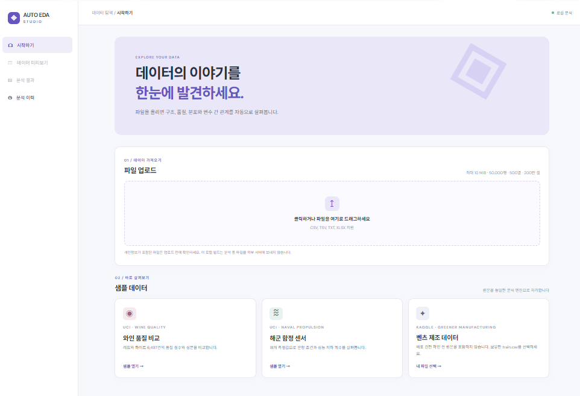
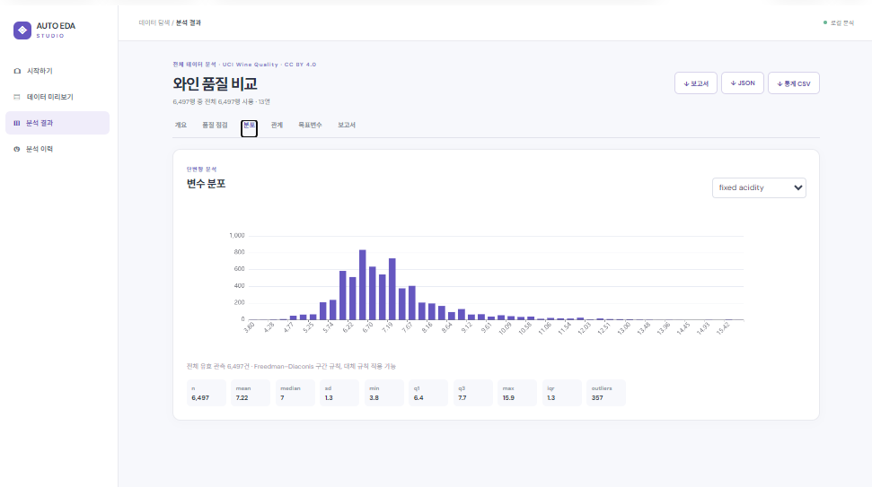
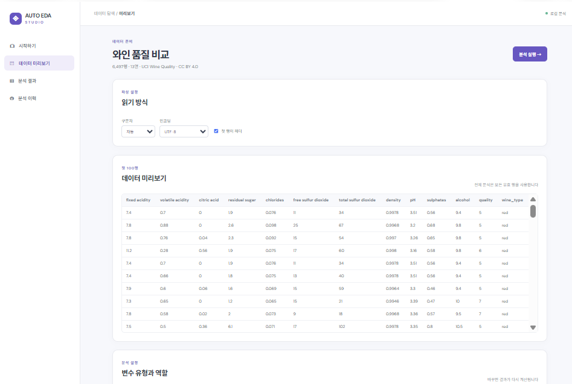

# Auto EDA Studio

CSV 파일과 표 형식 데이터를 브라우저에서 탐색적으로 분석하는 React/Vite 웹앱입니다. 기본 언어는 한국어이며 업로드부터 미리보기, 변수 설정, 품질 점검, 분포와 관계 분석, 보고서 다운로드까지 이어집니다.

## 실행

```bash
npm install
npm run dev
```

개발 서버 주소는 기본적으로 `http://127.0.0.1:5173/`입니다. 검증 명령은 `npm test`와 `npm run build`입니다.

## 이번 작업의 주요 내용

- CSV, TSV, TXT, XLSX 업로드와 구분자·인코딩·헤더 설정, 파싱 오류 행 표시, 첫 100행 미리보기를 구현했습니다.
- 변수 유형과 역할을 수정할 수 있으며, 행·열·결측·중복·상수 열을 점검합니다.
- 수치형 기술통계, 이상치 후보, 분포 그래프, Pearson·Spearman 상관계수와 목표변수 탐색을 제공합니다. 기술통계와 관계 계산에는 허용 범위의 전체 유효 행을 사용합니다.
- Markdown 보고서, JSON 결과, 기술통계 CSV 다운로드를 구현했습니다. 분석 실행 메타데이터는 이 브라우저의 로컬 저장소에 기록합니다.
- 와인과 해군 함정 원본 샘플을 연결했습니다. 와인 레드 1,599행·화이트 4,898행, 해군 함정 11,934행·18열을 파싱 테스트로 확인했습니다. 샘플 출처와 파일 해시는 [`public/samples/manifest.json`](public/samples/manifest.json)에 기록했습니다.
- 벤츠 `train.csv`는 4,209행·378열로 확인했습니다. Kaggle 재배포 권한 확인 전에는 원본을 저장소에 포함하지 않고 사용자가 보유한 파일을 직접 선택하도록 했습니다.

## 임시 저장과 CSV 변환

- **분석 실행**을 누르면 파싱된 데이터와 당시의 변수 유형·역할 설정을 브라우저 IndexedDB에 저장합니다. 새 데이터를 분석해도 이전 기록은 **분석 이력 → 결과 열기**에서 복원되며, 결과는 저장된 데이터와 설정으로 다시 계산합니다. 새로고침 후에도 복원할 수 있습니다.
- 기존 버전에서 파일명 등 메타데이터만 저장된 기록은 원본 데이터가 없어 복원할 수 없으며 **이전 기록**으로 표시됩니다. 이력의 **삭제**는 해당 임시 데이터도 삭제합니다.
- 저장은 현재 브라우저와 기기에만 적용됩니다. 브라우저 사이트 데이터를 지우거나 비공개 창을 종료하면 사라질 수 있으며, 저장 공간이 부족하면 오류를 보여줍니다. 민감한 데이터는 공용 기기에서 분석하지 마세요.
- CSV 외 TSV·TXT·XLSX 파일도 파싱 후 미리보기의 **CSV로 저장** 버튼으로 UTF-8 CSV로 내려받을 수 있습니다. 헤더 없는 공백 구분 TXT에는 생성된 열 이름이 들어갑니다. 파싱 오류 행은 변환본에서 제외되므로 다운로드 전 경고를 확인하세요. 스프레드시트 수식처럼 해석될 수 있는 텍스트는 이스케이프합니다.

## 오류 수정 및 검증

- Papa Parse 오류 객체의 행 번호가 없을 때 TypeScript 빌드가 실패하던 문제를 수정했습니다.
- 사용하지 않는 import로 인한 TypeScript 빌드 오류를 정리했습니다.
- UTF-8 BOM, 인용부호 안의 줄바꿈, 연속 공백 구분, 숫자 `0`의 결측 오인 가능성을 기준 테스트로 확인했습니다.
- 표본 표준편차, Type 7 분위수, 동률 평균 순위를 쓰는 Spearman, 상수 열의 계산 불가 처리를 테스트했습니다.
- `npm run build` 성공을 확인했습니다. 로컬 개발 서버의 앱과 샘플 manifest 요청도 HTTP 200으로 확인했습니다.
- 임시 저장된 와인·해군 분석 두 건이 함께 이력에 남고, 새로고침 후 와인 분석을 다시 여는 흐름을 브라우저에서 확인했습니다. CSV 변환 테스트를 추가해 현재는 11개 테스트가 통과합니다.

## 현재 범위

현재 빌드는 브라우저에서 분석하며 원본 파일과 전체 결과를 서버에 저장하지 않습니다. 브라우저 IndexedDB에는 파싱된 데이터와 분석 설정을 임시 저장합니다. 명세서의 공용 서비스 기능인 Clerk 인증, Neon 이력, private Blob 저장, Vercel Functions 실행·재시도와 서버 접근 제어는 아직 연결되지 않았습니다. PNG/SVG 및 ZIP 출력도 후속 작업입니다. Vercel 배포는 별도로 진행할 예정입니다.
